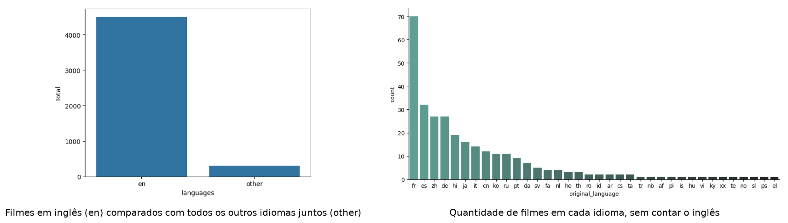

# basic-language-graph

Análise do idioma original dos filmes do [TMDB 5000 Movie Dataset](https://www.kaggle.com/datasets/tmdb/tmdb-movie-metadata), feita com pandas e seaborn.

## O que tem aqui

- `dashboard_movies.ipynb`: compara filmes em inglês com os de outros idiomas e mostra a quantidade de filmes de cada idioma além do inglês
- `TMDB5000filmes.ipynb`: primeira leitura dos dados
- `tmdb_5000_movies.csv`: base de dados (Kaggle)

## Resultado

Dos 4.803 filmes, 4.505 (93,8%) são originalmente em inglês. Os outros 298 se dividem entre 36 idiomas, com o francês na frente (70 filmes).



## Como rodar

```bash
pip install -r requirements.txt
jupyter notebook dashboard_movies.ipynb
```
